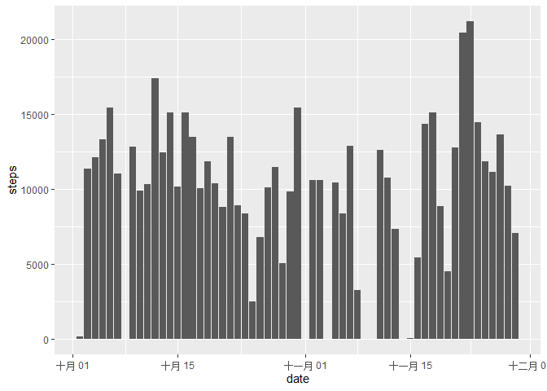
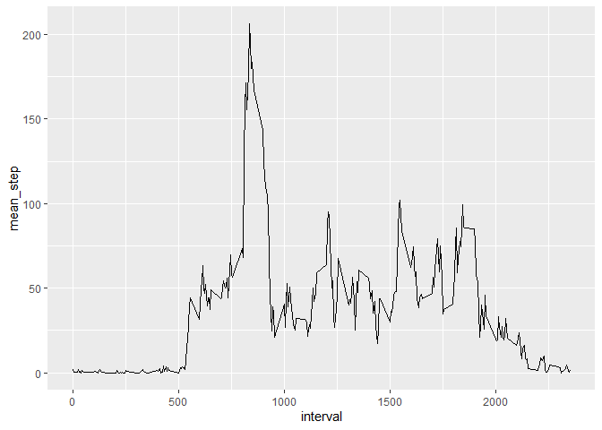
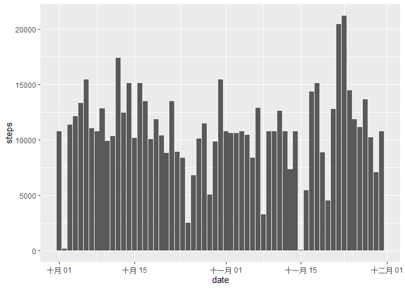
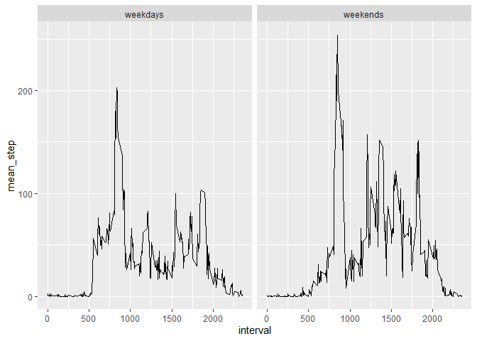

```r
library(readr)
library(tidyverse)
```

```
## ── Attaching packages ─────────────────────────────────────── tidyverse 1.3.2 ──
## ✔ ggplot2 3.3.6     ✔ dplyr   1.0.9
## ✔ tibble  3.1.8     ✔ stringr 1.4.1
## ✔ tidyr   1.2.0     ✔ forcats 0.5.2
## ✔ purrr   0.3.4     
## ── Conflicts ────────────────────────────────────────── tidyverse_conflicts() ──
## ✖ dplyr::filter() masks stats::filter()
## ✖ dplyr::lag()    masks stats::lag()
```

```r
library(lubridate)
```

```
## 
## 載入套件：'lubridate'
## 
## 下列物件被遮斷自 'package:base':
## 
##     date, intersect, setdiff, union
```
## Loading and preprocessing the data

```r
activity <- read_csv("activity.csv")
```

```
## Rows: 17568 Columns: 3
## ── Column specification ────────────────────────────────────────────────────────
## Delimiter: ","
## dbl  (2): steps, interval
## date (1): date
## 
## ℹ Use `spec()` to retrieve the full column specification for this data.
## ℹ Specify the column types or set `show_col_types = FALSE` to quiet this message.
```

## What is mean total number of steps taken per day?
below is a histogram of the total number of steps taken each day

```r
ggplot(activity) +
    geom_histogram(mapping = aes(date, steps), stat = "identity"
                   , na.rm = TRUE)
```

```
## Warning: Ignoring unknown parameters: binwidth, bins, pad
```

```
## Warning: Removed 2304 rows containing missing values (position_stack).
```

<!-- -->

```r
step_per_day <- tapply(activity$steps, activity$date, FUN = sum)
step_mean <- mean(step_per_day, na.rm = TRUE)
step_median <- median(step_per_day, na.rm = TRUE)
```
the mean of the total number of steps taken per day is 1.0766189\times 10^{4}   
the mean of the total number of steps taken per day is 1.0765\times 10^{4}

## What is the average daily activity pattern?

```r
activity_avg <- activity %>% 
    group_by(interval) %>% 
    summarise(mean_step = mean(steps, na.rm = TRUE))

ggplot(activity_avg) +
    geom_line(mapping = aes(interval, mean_step))
```

<!-- -->

```r
step_max <- activity_avg[which.max(activity_avg$mean_step), 1]
```
the interval contains the maximum number of steps is 835

## Imputing missing values

```r
na_num <- sum(is.na(activity))
```
there are 2304 NA  
replace NA with the mean for the interval

```r
activity1 <- left_join(activity, activity_avg, "interval")
activity1[is.na(activity$steps), 1] <- 
    activity1[is.na(activity$steps), 4]

ggplot(activity1) +
    geom_histogram(mapping = aes(date, steps), stat = "identity",
                   na.rm = TRUE)
```

```
## Warning: Ignoring unknown parameters: binwidth, bins, pad
```

<!-- -->

```r
step_per_day1 <- tapply(activity1$steps, activity1$date, FUN = sum)
step_mean1 <- mean(step_per_day1, na.rm = TRUE)
step_median1 <- median(step_per_day1, na.rm = TRUE)
```
new mean of the total number of steps taken per day is 1.0766189\times 10^{4}  
new mean of the total number of steps taken per day is 1.0766189\times 10^{4}  
there are little difference between the new value and the estimated value

## Are there differences in activity patterns between weekdays and weekends?

```r
activity1$weekday <- factor(if_else(wday(activity1$date) %in% 
                                        c(6, 7),
                                    "weekends",
                                    "weekdays"))

activity_weekday <- activity1 %>% 
    group_by(interval, weekday) %>% 
    summarise(mean_step = mean(steps, na.rm = TRUE))
```

```
## `summarise()` has grouped output by 'interval'. You can override using the
## `.groups` argument.
```

```r
ggplot(activity_weekday) +
    geom_line(mapping = aes(interval, mean_step)) +
    facet_wrap(~weekday)
```

<!-- -->
